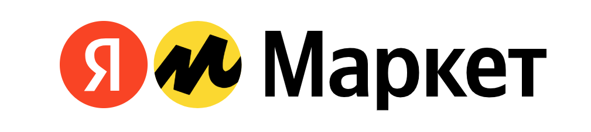

# go-yandex-market



**go-yandex-market** is a Rest API for [Yandex Market](https://market.yandex.ru). You can manage
your application with this library. It contains multiple
API requests Yandex Market provides with support of CRUD operations.

## Quick Start / Installation

To get started with **go-yandex-market**, you'll need to do the following:

- Install the latest version of Go.
- Install the **go-yandex-market** package using go get.
- Use the **go-yandex-market** package in your Go code.
- Here's an example of how to install the package:

```
go get github.com/whatcrm/go-yandex-market
```

## Models

**go-yandex-market** includes a package for working with models, which allows you to use just the API and **create your own models**.
This means you can create your own structs and use them with our **go-yandex-market** package,
even if you don't want to use every field from Yandex Market's entities.

Here's the link to [Models](https://github.com/whatcrm/go-yandex-market/models) package and example of how to install the package.

```
go get github.com/whatcrm/go-yandex-market/models
```

## Features

- *Lightweight and easy-to-use*
- Simple and efficient net/http solution
- Comprehensive **CRUD** for working with Yandex Market

## Ecosystem / Documentations

- [Yandex Market documentation](https://yandex.ru/dev/market/partner-api/doc/ru/)
- [net/http client](https://pkg.go.dev/net/http)

## Contributors

> **go-yandex-market** is maintained by [WhatCRM Organization](https://github.com/whatcrm).
> If you'd like to contribute to the project, please reach out to us via [Issues](https://github.com/whatcrm/go-yandex-market/issues).
